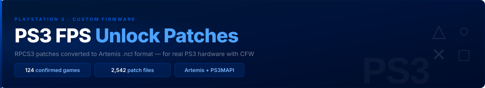

  

# PS3 FPS Unlock Patches

FPS unlock patches for **real PS3 hardware** (Custom Firmware required — Artemis optional).  
Four ways to apply: **Artemis** cheats, live **PS3MAPI** memory edits, **pre-patched EBOOTs**, or **config-file** tweaks.  
Sourced from the RPCS3 emulator patch database and the PSXPlace community.

---

## Start here

> **New to this?** Pick the right method for your situation:

| Your situation | Use this | Section |
|----------------|----------|---------|
| I want a tested, plug-and-play patch | **`Working Artemis Patches/`** folder (39 games) | [Confirmed (39)](#confirmed-working-games-39-games) |
| My game isn't in that folder | **`PSXPlace Confirmed/`** folder (93 games) | [Community Confirmed](#community-confirmed-games--psxplace-) |
| My game isn't in either folder | Full **`USERLIST/`** (2,542 files, mixed confidence) | [About USERLIST](#about-userlist-2542-files) |
| I don't want to FTP files | **PS3MAPI** (apply patches live in browser, ~74 games) | [`MAPI_PATCHES.md`](MAPI_PATCHES.md) |
| I want the patch permanent, zero setup | **Pre-patched EBOOTs / PKGs** by Nascar1243 (70 games) | [`EBOOT_PATCHES.md`](EBOOT_PATCHES.md) |
| My game has a config file (Crysis, BBC, etc.) | **File-based unlock** (no Artemis at all) | [File-Based](#file-based-fps-unlocks-no-artemis-needed) |

---

## Downloads

The latest release (`v2.0`) has one zip with two folders:

| Folder in zip | Contents | Use when |
|---------------|----------|----------|
| **`Working Artemis Patches/`** | 39 games — 100% confirmed on real PS3 | Your game is in the list below |
| **`PSXPlace Confirmed/`** | 93 games — confirmed by Joey85 + Nascar1243 + community on real PS3 | Your game isn't in the first folder |

**[→ Download v2.0](https://github.com/DoSpamu/RPCS3toArtemisPatches/releases/tag/v2.0)**

> [!NOTE]
> Release zips are snapshots. The folders in this repository are updated **daily** by the PSXPlace monitor, so they may contain newer games than the latest release. For the freshest files, clone the repo or use **Code → Download ZIP**.

If your game isn't in either folder, the full **`USERLIST/`** (2,542 files) is available by cloning or downloading the repository. Those files are RPCS3 conversions — not all hardware-verified.

> [!TIP]
> **Some games don't need Artemis at all.** Crysis, Condemned 2, F.E.A.R. 2, Shadow of Mordor, Battlefield Bad Company 1/2 and others let you set the FPS cap via a config file. See the **File-Based FPS Unlocks** section in [`COMMUNITY_TESTED.md`](COMMUNITY_TESTED.md).

---

## How to use (Artemis method)

**Requirements:**
- PS3 with **Custom Firmware** (HEN, Rebug, etc.)
- [**Artemis PS3 R5**](https://www.psx-place.com/resources/artemis-ps3.522/) — R5 recommended, R6 may have issues
- [**webMAN MOD**](https://github.com/aldostools/webMAN-MOD) — for FTP access

**Steps:**
1. Connect to your PS3 via FTP
2. Navigate to `hdd0/game/ARTZ00001/USRDIR/USERLIST/`
3. Copy the `.ncl` file for your game from the zip
4. Open Artemis, find your game, enable the FPS patch
5. Launch the game, then press **PS + Start** to attach cheats

---

## How to use (PS3MAPI method — no file transfer needed)

Apply patches live via webMAN MOD's browser interface without Artemis. See [`MAPI_PATCHES.md`](MAPI_PATCHES.md) for the full address list and instructions.

---

## How to use (pre-patched EBOOTs — patch baked in)

Nascar1243 shares ready-made patched `EBOOT.BIN` files and update PKGs for 70 games — install once, the FPS patch is permanent. See [`EBOOT_PATCHES.md`](EBOOT_PATCHES.md) for the game list, download link and instructions.

---

## Confirmed Working Games (39 games)

These files are in `Working Artemis Patches/` and are verified working on real PS3 hardware:

| Game | Title ID | Version |
|------|----------|---------|
| Destroy All Humans! Path of the Furon | BLES00467 | — |
| Dragon Ball Z: Burst Limit | BLUS30117 | v01.00 |
| Drakengard 3 | BLUS31197 | 01.01 |
| Fallout 3 | BLUS30185 | 01.61 |
| Fallout: New Vegas Ultimate Edition | BLES01475 | 01.00 |
| Final Fantasy XIII | MRTC00003 | v01.00 |
| Folklore | BCAS20013 / BCES00050 / BCUS98147 | 01.00 |
| God of War: Ascension | BCUS98232 | v01.00 av01.12 |
| Grand Theft Auto IV | BLUS30127 | v01.00 av01.08 |
| Hatsune Miku: Project DIVA F | BLUS31319 | 01.00 |
| Hatsune Miku: Project DIVA F 2nd | BLUS31431 | 01.00 |
| Just Cause 2 | BLES00517 / BLUS30400 | 01.02 |
| Kingdom Hearts HD 1.5 ReMIX | BLUS31212 | 01.00 |
| Kingdom Hearts HD 2.5 ReMIX | BLUS31460 | 01.00 |
| Kingdoms of Amalur: Reckoning | BLUS30710 | v01.02 |
| Lost Dimension | BLUS31554 | v01.00 |
| Lost Planet 2 | MRTC00002 | v01.02 |
| Lost Planet 3 | BLUS31020 | v01.02 |
| Metal Gear Solid 4: Guns of the Patriots | BLUS30109 | — |
| MotorStorm | BCUS98137 | v01.00 |
| Need for Speed: Rivals | BLUS31201 | 01.03 |
| Pirates of the Caribbean: At World's End | BLUS30029 | v01.00 |
| Resident Evil 5 | BLUS30270 | v02.00 |
| Resistance 2 | BLUS98120 | 01.60 |
| Resistance 3 | BCUS98176 | 01.05 |
| Shadow of the Colossus (HD) | BCES01097 | 01.01 |
| Shadow of the Colossus (HD) | BCES01097 / BCES01115 / BCUS98259 / NPEA00280 | v01.00 av01.01 |
| Silent Hill: Downpour | BLUS30565 | 01.01 |
| Silent Hill: Homecoming | BLUS30169 | 01.00 |
| Skate 2 | BLUS30253 | v01.02 |
| Skate 3 | BLUS30464 | v01.05 |
| The Elder Scrolls IV: Oblivion GOTY | BLUS30087 | 01.00 |
| The Elder Scrolls V: Skyrim | BLUS30778 | v01.00 |
| The Elder Scrolls V: Skyrim Legendary Edition | BLUS31202 | 01.00 |
| The Last of Us | BCUS98174 / BCES01584 / BCES01585 / BCAS20270 | v01.11 |
| Tony Hawk's Project 8 | BLUS30011 | v01.00 |
| Tony Hawk's Proving Ground | BLUS30071 | v01.00 |
| Uncharted: Drake's Fortune | BCES00065 / BCUS98103 | 01.10 |
| Uncharted 2: Among Thieves | BCUS98213 | 01.09 |

---

## Community Confirmed Games — PSXPlace (✅)

Confirmed on real PS3 hardware by community members. Sources: **Joey85** (PSXPlace #49905), **Nascar1243** ([PS3-FPS-Patches](https://github.com/Nascar1243/PS3-FPS-Patches) — 3 weeks real-hardware testing), **FlexBy**, **vFxMz**, **illusion**, **NunoRS2000**, and others. All entries are in `USERLIST/` with `(PSXPlace)` in the cheat name.

| Game | Title ID | Version | Patch | Author |
|------|----------|---------|-------|--------|
| Alice Madness Returns | BLUS30607 | 01.00 | Unlock FPS | Joey85 |
| Alien Isolation | BLES01697 | 01.02 | Unlock FPS | Joey85 |
| Alien Rage | NPEB01088 | 01.00 | Unlock FPS | Joey85 |
| Aliens Colonial Marines | BLES01455 / BLUS30862 | 01.05 | Unlock FPS | Joey85 |
| Alpha Protocol | BLUS30341 | 01.00 | Unlock FPS | Joey85 |
| Asura's Wrath | BLUS30721 | 01.02 | Unlock FPS | Joey85 |
| Batman Arkham Asylum GOTY | BLUS30515 | 01.00 | Debug Menu | Joey85 |
| Batman Arkham City | BLES01587 / BLUS30978 | v01.01 av01.00 | Debug Menu | Joey85 |
| Batman Arkham Origins | BLUS31147 / BLUS31207 | 01.06 | Debug Menu | PSXPlace |
| Blur | BLES00759 | 01.02 | Unlock FPS | Joey85 |
| Borderlands 2 | BLES01684 | 01.02 | Unlock FPS | FlexBy |
| Brutal Legend | BLES00562 | 01.02 | Unlock FPS | Joey85 |
| Bulletstorm | BLES01134 | 01.03 | Unlock FPS | Joey85 |
| Castle Crashers | NPEB00293 | 01.00 | 60 FPS | FlexBy |
| Condemned 2 Bloodshot | BLUS30115 | 01.01 | Unlock FPS | Joey85 |
| Dead Space | BLES00308 | 01.00 | Unlock FPS | Joey85 |
| Dead Space 2 | BLES01040 | 01.02 | Unlock FPS | Joey85 |
| Dead Space 3 | BLES01733 / BLUS31053 | 01.02 | Unlock FPS | Joey85 |
| Deadpool | BLES01789 / BLUS31146 | 01.00 | Unlock FPS | Joey85 |
| Destroy All Humans! Path Of The Furon | BLES00467 | — | Unlock FPS | PSXPlace |
| Deus Ex Human Revolution Directors Cut | BLUS31317 | 01.00 | Unlock FPS | Joey85 |
| Disney Castle Of Illusion Starring Mickey Mouse | NPUB31099 | 01.00 | Unlock FPS | Joey85 |
| Dragon Ball Z Burst Limit | BLES00231 | 01.00 | 60 FPS | illusion |
| Dragon Ball Z Burst Limit | BLUS30117 | 01.00 | 60 FPS | illusion |
| Dragon's Dogma | BLUS30720 | 01.05 | Unlock FPS v01.05 | Nascar1243 |
| Dragon's Dogma Dark Arisen | BLUS31155 | 01.02 | Unlock FPS v01.02 | Nascar1243 |
| Duke Nukem Forever | BLES01147 | 01.03 | Unlock FPS | Joey85 |
| Enslaved Odyssey To The West | BLES00989 | 01.01 | Unlock FPS | Joey85 |
| Fallout 3 GOTY Edition | BLUS30451 | 01.00 | Unlock FPS | Joey85 |
| Fallout New Vegas Ultimate Edition | BLUS30888 | 01.00 | Unlock FPS | PSXPlace |
| FINAL FANTASY XIII | MRTC00003 | 01.00 | Unlock FPS | illusion |
| Folklore | BCES00050 | 01.10 | Unlock FPS | RPCS3 |
| Grand Theft Auto IV Complete Edition | BLES01128 | 01.00 | Unlock FPS | Zolika1351/illusion |
| Harry Potter And The Order Of The Phoenix | BLES00070 | 01.01 | 60 FPS | NunoRS2000 |
| Haze | BLES00157 / BLES00169 / BLUS30094 | v01.00 av01.36 | Unlock FPS | Joey85 |
| Homefront | BLES00962 | 01.04 | Unlock FPS | Joey85 |
| I Am Alive | NPUB30383 | 01.00 | Unlock FPS | Joey85 |
| inFamous 2 | NPUA80638 | 01.00 | Unlock FPS | Dukem02 |
| James Camerons Avatar The Game | BLUS30374 | 01.00 | Unlock FPS | Joey85 |
| Just Cause 2 | NPUB30606 | 01.02 | Unlock FPS | illusion |
| Killer Is Dead | BCAS20292 | 01.00 | Unlock FPS | FlexBy / Joey85 |
| Killzone 2 | BCES00081 / BCUS98116 | 01.29 | Unlock FPS | Joey85 |
| Killzone 3 | BCES01007 / BCUS98234 | 01.14 | Extended FOV | vFxMz |
| Lollipop Chainsaw | BLES01525 | 01.00 | Unlock FPS | Joey85 |
| Lollipop Chainsaw PE | BLUS30917 | 01.00 | Unlock FPS | Nascar1243 |
| Lost Dimension | BLES02197 / BLUS31554 / BLJM61166 | 01.01 | 60 FPS | FlexBy |
| Lost Planet 2 | MRTC00002 | 01.01 | Unlock FPS | PSXPlace |
| Lost Planet 3 | BLUS31020 | 01.02 | Unlock FPS | Joey85 |
| METAL GEAR SOLID 4 GUNS OF THE PATRIOTS | BLES00246 | 02.00 | Unlock FPS | RPCS3 |
| Mindjack | MRTC00014 | 01.01 | Unlock FPS | Joey85 |
| Mirrors Edge | BLES00322 | 01.01 | Unlock FPS | Joey85 |
| MotorStorm | BCES00006 | 01.00 | Unlock FPS | RPCS3 |
| Need for Speed Rivals | BLUS31201 | 01.03 | Unlock FPS | Joey85 |
| Need for Speed SHIFT | BLUS30391 | 01.03 | Unlock FPS | Joey85 |
| Need for Speed SHIFT 2 UNLEASHED | BLUS30580 | 01.02 | Unlock FPS | Joey85 |
| Prince Of Persia Trilogy 3D | BLUS30754 | 01.00 | The Two Thrones Unlock FPS | Joey85 |
| Prototype 2 | BLES01532 / BLUS30756 | 01.00 | UnlockFPS | Joey85 |
| Ratchet And Clank All 4 One | BCAS20200 / BCES01141 / BCJS30081 / BCUS98175 / NPEA00356 | 01.03 | Unlock FPS | Joey85 |
| Ratchet And Clank Into The Nexus | BCUS99245 | 01.00 | Unlock FPS | Nascar1243 |
| Ratchet And Clank Nexus | BCES01908 | 01.01 | Unlock FPS | Joey85 |
| Remember Me | BLES01701 | 01.00 | Unlock FPS | Joey85 |
| Resident Evil 5 Gold Edition | BLES00816 | 01.01 | Unlock FPS | PSXPlace |
| Resident Evil 6 | BLUS30855 | v01.01 av01.06 | Unlock FPS | Joey85 |
| Resident Evil Remaster | NPEB02076 / NPJB00653 / NPUB31552 | v01.00 av01.00 | Unlock FPS | Joey85 |
| Resident Evil Revelations | BLES01773 | 01.01 | Unlock FPS | RPCS3 |
| Resident Evil Revelations 2 | BLUS31444 | v01.00 av01.04 | Unlock FPS | Joey85 |
| Resident Evil The Darkside Chronicles | NPEB00816 / NPUB30648 | v01.00 av01.00 | Unlock FPS | Joey85 |
| Resident Evil The Umbrella Chronicles | NPEB00817 / NPUB30650 | v01.01 av01.00 | Unlock FPS | Joey85 |
| Resistance 2 | BCES00226 | 01.60 | Unlock FPS | Joey85 |
| Resistance 3 | BCES01118 / BCUS98176 | 01.00 | Unlock FPS | PSXPlace |
| Saw | BLES00676 | 01.00 | Unlock FPS | Joey85 |
| Saw 2 | BLES01050 | 01.00 | Unlock FPS | Joey85 |
| Shadows Of The Damned | BLES01276 | 01.00 | Unlock FPS | Joey85 |
| Silent Hill Downpour | BLUS30565 | 01.01 | Unlock FPS | Joey85 |
| Silent Hill Homecoming | BLES00460 | 01.00 | Unlock FPS | RPCS3 |
| Siren Blood Curse | BCES00294 | 01.00 | Unlock FPS | Joey85 |
| Skyrim | BLUS31202 | 01.00 | Unlock FPS | RPCS3 |
| Sleeping Dogs | BLUS30927 | 01.04 | Unlock FPS | Joey85 |
| Sonic Unleashed | BLUS30244 | 01.02 | Disable Shadows | illusion |
| STRANGLEHOLD | BLES00144 | 01.20 | Unlock FPS | RPCS3 |
| The Bureau XCOM Declassified | BLUS30780 | 01.02 | Unlock FPS | Joey85 |
| The Evil Within | BLES01916 | 01.05 | Unlock FPS | Joey85 |
| The Godfather II | BLES00477 | 01.01 | Unlock FPS | Joey85 |
| The Last of Us | BCES01585 | 01.11 | Unlock FPS | illusion |
| The Orange Box Half-Life 2 | BLES00153 / BLUS30055 | av01.10 | Unlock FPS | PSXPlace |
| Tom Clancy's Splinter Cell Blacklist | BLUS31025 / BLES01879 / BLES01766 | 01.03 | Unlock FPS | Joey85 |
| Tomb Raider | BLUS31036 | 01.03 | Unlock FPS | Joey85 |
| Transformers War For Cybertron | BLES00833 / BLUS30357 | 01.01 | Unlock FPS | Joey85 |
| Uncharted Drake's Fortune | BCES00065 | 01.01 | Unlock FPS | RPCS3 |
| Warhammer 40000 Space Marine | BLES01347 | 01.05 | Unlock FPS | Joey85 |
| WATCH_DOGS | BLUS31176 | 01.04 | Unlock FPS | Joey85 |
| WET | BLES00707 | 01.00 | Unlock FPS | Joey85 |
| Wheelman | BLUS30262 | 01.01 | Unlock FPS | Joey85 |

---

## File-Based FPS Unlocks (No Artemis Needed)

Some games store FPS limits in config files — edit via FTP. Access: **Multiman** → back up as **JB Folder** → edit file via FTP.

| Game | Title ID | File to Edit | Change | Notes |
|------|----------|-------------|--------|-------|
| Battlefield Bad Company | BLES00261 v1.20 | `Ps3GameSettings.cfg` | Set FPS value | Max 60 — higher breaks HUD |
| Battlefield Bad Company 2 | BLES00779 v1.05 | `Ps3GameSettings.cfg` | Set FPS value | Same mod as BBC1; confirmed Joey85 |
| Condemned 2: Bloodshot | BLUS30115 v1.00 | `PS3_GAME/USRDIR/autoexec.cfg` | Delete `MaxFPS` line | Default 40 FPS → ~60 FPS |
| Crysis | — | `PS3_GAME/USRDIR/autoexec.cfg` | Add `sys_maxfps = 60` | Vsync commands in .cfg do not work |
| Crysis 2 | BLUS30631 v1.04 | `PS3_GAME/USRDIR/autoexec.cfg` | Add `sys_maxfps = 60` | Same as Crysis |
| Crysis 3 | BLES01649 v1.04 | `PS3_GAME/USRDIR/autoexec.cfg` | Add `sys_maxfps = 60` | Same as Crysis |
| F.E.A.R. 2: Project Origin | BLES00464 | `PS3_GAME/USRDIR/autoexec.cfg` | Delete `MaxFPS`; set VSyncOnFlip 0 | Default 45 FPS → ~60 FPS |
| Middle-Earth: Shadow of Mordor | — | `PS3_GAME/USRDIR/autoexec.cfg` | Delete `MaxFPS` line | Default 45 FPS → ~60 FPS |
| Syndicate | BLUS30804 v1.00 | `ENVIRONMENT_PS3.CFG` | Change vsync value to `0` | ⚠️ Binary file — use hex editor |

> Condemned 2, F.E.A.R. 2, and Shadow of Mordor all use the LithTech Jupiter EX engine — same `MaxFPS` mechanism.

For full details see [`COMMUNITY_TESTED.md`](COMMUNITY_TESTED.md).

---

## About `USERLIST/` (2,542 files)

The full patch database. Sources:
- RPCS3 patch.yml (auto-converted by `convert.js`)
- PSXPlace community patches — hardware-confirmed games are listed in the [Community Confirmed](#community-confirmed-games--psxplace-) table above, and the daily monitor keeps them in sync
- Upstream [ArtemisPS3](https://github.com/bucanero/ArtemisPS3) USERLIST

**Not all patches are guaranteed to work on real hardware.** Use the label in the cheat name to judge:

| Label in cheat name | Meaning |
|---------------------|---------|
| `[Tested]` | Confirmed working on real PS3 |
| `(PSXPlace)` | Written for real hardware by community (FlexBy, Joey85, vFxMz, etc.) |
| `(RPCS3)` | Converted from RPCS3 patch.yml — not all HW-verified |
| `v01.XX (RPCS3)` | Version mismatch — test carefully, may crash |

---

## Known crashes / do not use

| Game | Issue |
|------|-------|
| Grand Theft Auto V | Freezes on real PS3 — do not use |
| MGS3 HD "50 FPS" patch | Reduces FPS from native 60 — not useful |
| JoJo's Bizarre Adventure: All Star Battle | Requires 120Hz Vblank — not possible on real PS3 |

---

## Where does patch data come from?

- [RPCS3 patch.yml](https://github.com/RPCS3/rpcs3/blob/master/bin/patch.yml) — official RPCS3 patch database
- [PSXPlace FPS patches thread #49905](https://www.psx-place.com/threads/60-unlock-fps-patches.49905/) — Joey85 (Ghidra reverse engineering, tested on real PS3)
- [Nascar1243/PS3-FPS-Patches](https://github.com/Nascar1243/PS3-FPS-Patches) — 3 weeks of real-hardware testing, simplified working addresses
- [PSXPlace game patches thread #43706](https://www.psx-place.com/threads/game-patches.43706/) — community real-hardware patches (FlexBy, vFxMz, illusion, etc.)
- [PS3 Codes spreadsheet](https://docs.google.com/spreadsheets/d/1dvcFTU5xKt9ASbjlhaSD1zN1ONQPCFnmJNKMU5hGGNM/) — community test results
- [bucanero/ArtemisPS3](https://github.com/bucanero/ArtemisPS3) — upstream USERLIST source

`convert.js` automates format conversion from RPCS3 YAML to Artemis `.ncl` text format.

---

## Requirements

- PS3 with Custom Firmware (HEN / Rebug / etc.)
- Artemis PS3 R5
- webMAN MOD (for FTP + FPS counter overlay)
- FTP client (FileZilla, etc.)

---

## Disclaimer

For use with legally obtained PS3 games and CFW consoles only. All patches are for single-player use. Using cheats online may result in a ban.
